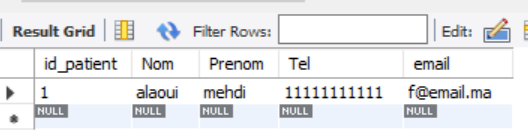
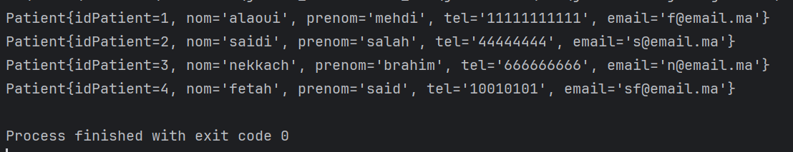
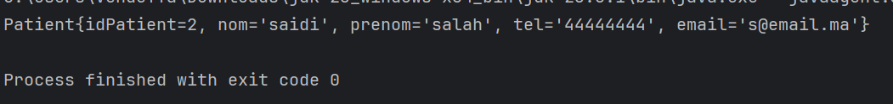
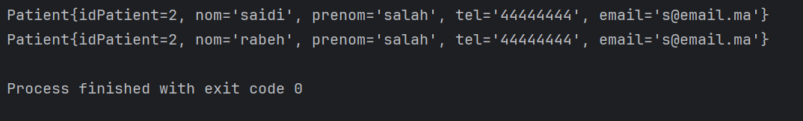
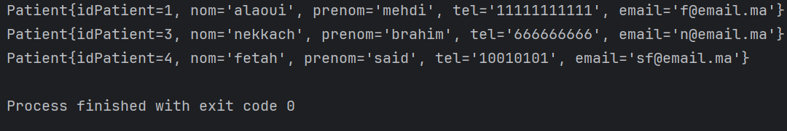

<h1>JDBC Exercise</h1>
<h2>Insert into database</h2>

<h2>Get List of patients in Data Base</h2>

<h2>Get patient by id</h2>

<h2>Update patient info</h2>

<h2>Delete patient where id = 2, and get the list of the patients remaining in the database</h2>
